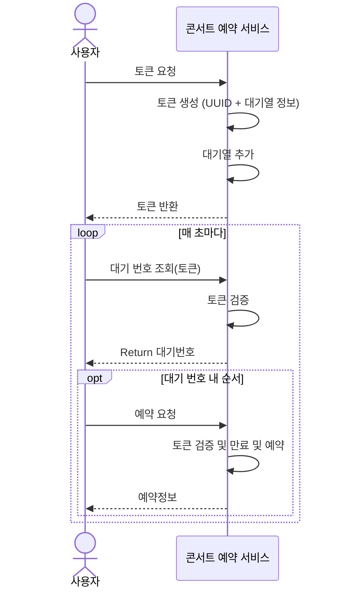
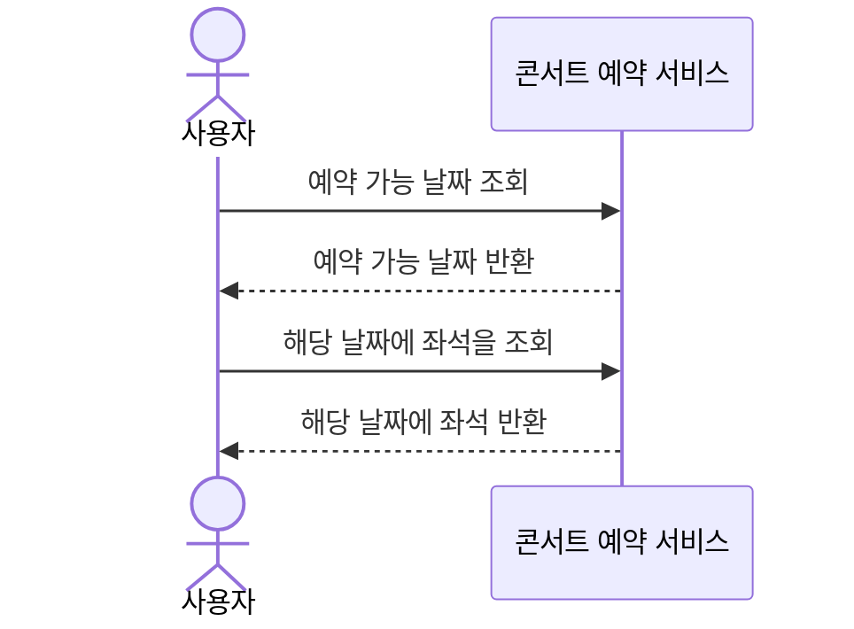
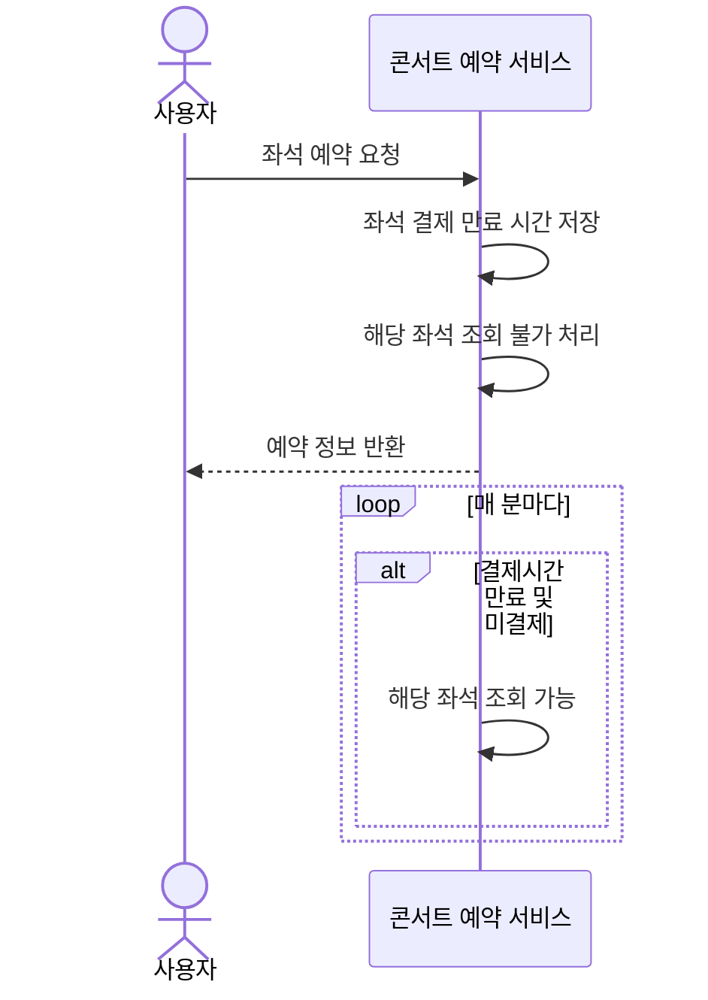
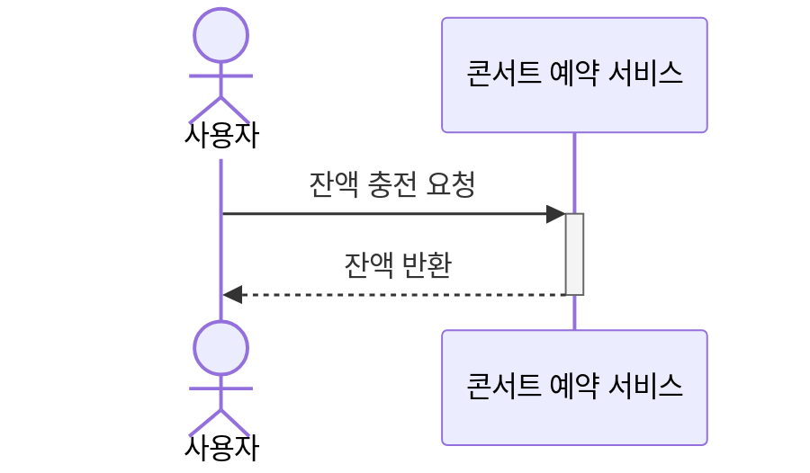
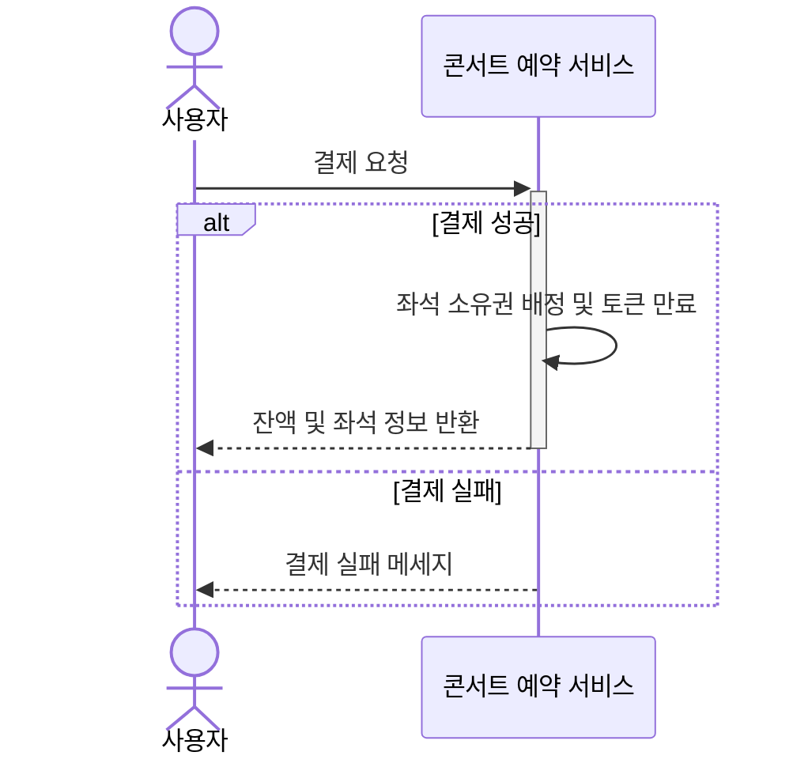
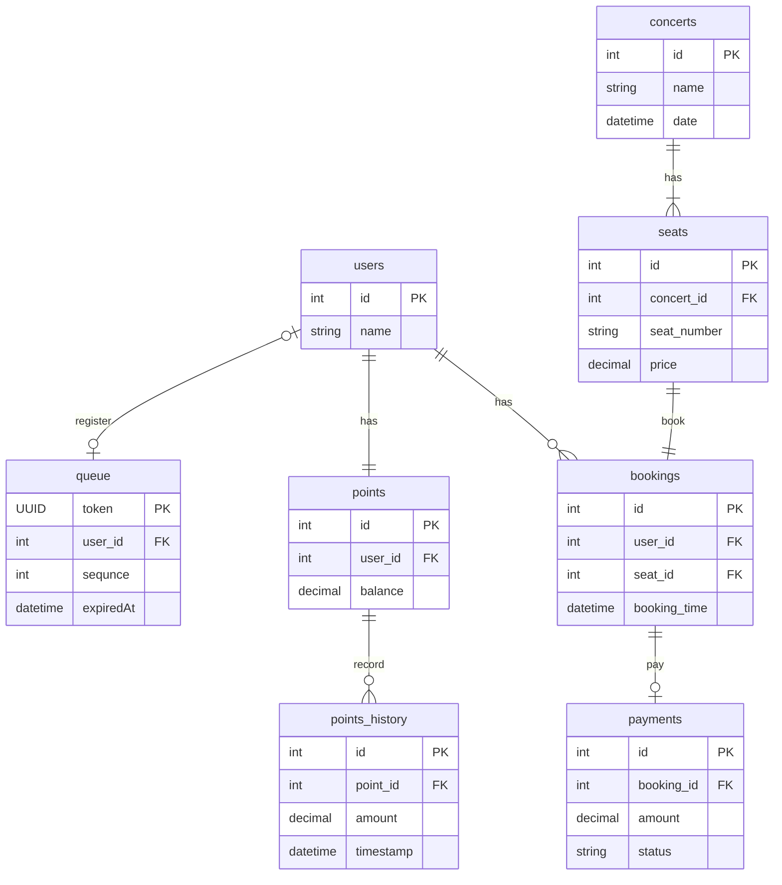
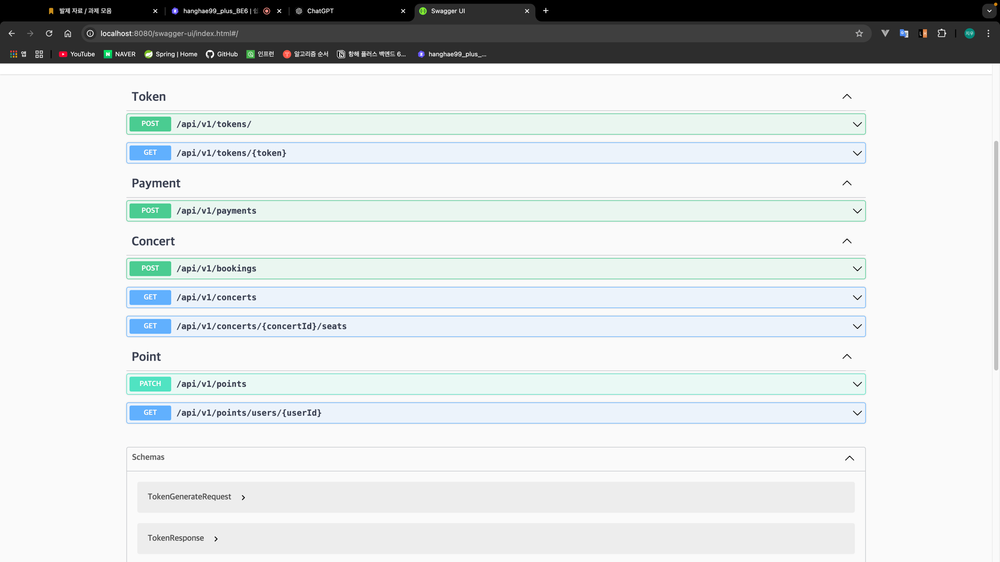

# 콘서트 예약 서비스

## 1. Milestone

### 1주차: 프로젝트 초기 설정 및 기획
- 요구사항 분석
  - 예약 시스템의 주요 기능 및 백엔드 요구사항 분석
  - 시퀀스 다이어그램
- 프로젝트 기본 설정
  - Kotlin, Spring Boot 설정, 기본 구조 생성
  - ERD 설계
  - API 명세 및 Mock API 작성

### 2주차: 애플리케이션 개발
  - 유저 토큰 발급
    - 토큰 발급 API
    - 토큰 조회 및 대기정보 조회 API
  - 예약 가능 날짜 / 좌석 API
    - 예약 가능 콘서트 조회 API
    - 날짜에 해당하는 좌석 조회 API
  - 좌석 예약 요청 API
  - 잔액 충전 / 조회 API
    - 잔액 충전 API
    - 잔액 조회 API
  - 결제 API

### 3주차: 최종 테스트 및 배포
  - 개발 최종 보완
  - 통합 테스트

## 2. 요구사항별 분석 자료

### 유저 토큰 발급 API
- 서비스를 이용할 토큰을 발급받는 API를 작성합니다.
- 토큰은 유저의 UUID 와 해당 유저의 대기열을 관리할 수 있는 정보 ( 대기 순서 or 잔여 시간 등 ) 를 포함합니다.
- 이후 대기열에 의해 **보호받는** 모든 API 는 위 토큰을 이용해 대기열 검증을 통과해야 이용 가능합니다.
- **내 대기번호를 조회하는 폴링용 API를 작성합니다.**
> 기본적으로 폴링으로 본인의 대기열을 확인한다고 가정하며, 다른 방안 또한 고려해보고 구현해 볼 수 있습니다.

### 예약 가능 날짜 / 좌석 API
- 예약가능한 날짜와 해당 날짜의 좌석을 조회하는 API 를 각각 작성합니다.
- 예약 가능한 날짜 목록을 조회할 수 있습니다.
- 날짜 정보를 입력받아 예약가능한 좌석정보를 조회할 수 있습니다.
> 좌석 정보는 1 ~ 50 까지의 좌석번호로 관리됩니다.

### 좌석 예약 요청 API
- 좌석 예약과 동시에 해당 좌석은 그 유저에게 약 5분간 임시 배정됩니다. ( 시간은 정책에 따라 자율적으로 정의합니다. )
- 날짜와 좌석 정보를 입력받아 좌석을 예약 처리하는 API 를 작성합니다.
- 만약 배정 시간 내에 결제가 완료되지 않는다면 좌석에 대한 임시 배정은 해제되어야 하며 임시배정 상태의 좌석에 대해 다른 사용자는 예약할 수 없어야 한다.

### 잔액 충전 / 조회 API
- 결제에 사용될 금액을 API 를 통해 충전하는 API 를 작성합니다.
- 사용자 식별자 및 충전할 금액을 받아 잔액을 충전합니다.
- 사용자 식별자를 통해 해당 사용자의 잔액을 조회합니다.

### 결제 API
- 결제 처리하고 결제 내역을 생성하는 API 를 작성합니다.
- 결제가 완료되면 해당 좌석의 소유권을 유저에게 배정하고 대기열 토큰을 만료시킵니다.


## 3. ERD

### 특이사항
- 콘서트는 좌석마다 가격이 다르기에 가격은 seats에 넣었습니다
- 다중 인스턴스 요구사항에 맞춰 queue 도 설계




## 4. API 명세
### 유저 토큰 발급
1. 토큰 발급 API
- URL: `/api/v1/tokens/`
- Method: `POST`
- Description: 유저에게 대기열 인증 토큰을 발급합니다.

Request
```json
{
  "userId": 1
}
```
Response
```json
{
  "userId": 1,
  "token": "some-uuid",
  "expiredAt": "YYYY-MM-DDTHH:MM:SS"
}
```
2. 토큰 조회 및 대기정보 조회 API
- URL: `/api/v1/tokens/{token}`
- Method: `GET`
- Description: 현재 대기열 정보를 보여줍니다.

Response
```json
{
  "queuePosition": 12,
  "queueSize": 20
}
```
### 예약 가능 날짜 / 좌석 API
1. 예약 가능 콘서트 조회 API
- URL: `/api/v1/conserts`
- Method: `GET`
- Description: 예약 가능한 콘서트 목록을 보여줍니다.

Request(Query Params)
- `date`:`YYYY-MM-DD`(optional)

Response

```json
[
  {
    "id": 1,
    "name": "some-name",
    "date": "YYYY-MM-DDTHH:MM:SS"
  }
]
```
2. 날짜에 해당하는 좌석 조회 API
- URL: `/api/v1/concerts/{concertId}/seats`
- Method: `GET`
- Description: 특정 날짜의 예약 가능한 좌석 정보를 조회합니다.

Request(Query Params)
- `date`:`YYYY-MM-DD`

Response

```json
{
  "concertId": 123,
  "date": "YYYY-MM-DDTHH:MM:SS",
  "seats": [
    {
      "seatId": 1,
      "price": 120.00,
      "seatNumber": 1
    },
    {
      "seatId": 2,
      "price": 80.00,
      "seatNumber": 2
    }
  ]
}
```
### 좌석 예약 요청 API

- URL: `/api/v1/bookings`
- Method: `POST`
- Description: 유저가 좌석을 예약 요청합니다.

Request

```json
{
  "token": "token",
  "concertId": 1,
  "seatId": 1
}
```

Response

```json
{
  "bookingId": 1,
  "concertId": 1,
  "seatId": 1,
  "bookedAt": "YYYY-MM-DDTHH:MM:SS"
}
```

### 잔액 충전 / 조회 API
1. 잔액 충전 API
- URL: `/api/v1/points/`
- Method: `POST`
- Description: 유저가 포인트 충전 요청합니다.

Request

```json
{
  "userId": 1,
  "amount": 100
}
```
Response

```json
{
  "balance": 100
}
```
2. 잔액 조회 API
- URL: `/api/v1/users/1/points/`
- Method: `GET`
- Description: 유저가 포인트 잔액을 조회합니다.

Response

```json
{
  "balance": 100
}
```
### 결제 API
- URL: `/api/v1/payments`
- Method: `POST`
- Description: 예약한 좌석에 대해 결제를 진행합니다.

Request

```json
{
  "userId": 1,
  "concertId": 1,
  "seatId": 1,
  "bookingId": 1
}
```
Response

```json
{
  "paymentId": 1,
  "paidAmount": 100,
  "balance": 0
}
```

### 실패

Response
```json
{
  "message": "error message"
}
```

5. Swagger


6. [동시성](docs/concurrency.md)
7. [캐시와 redis](docs/cache-and-redis.md)
