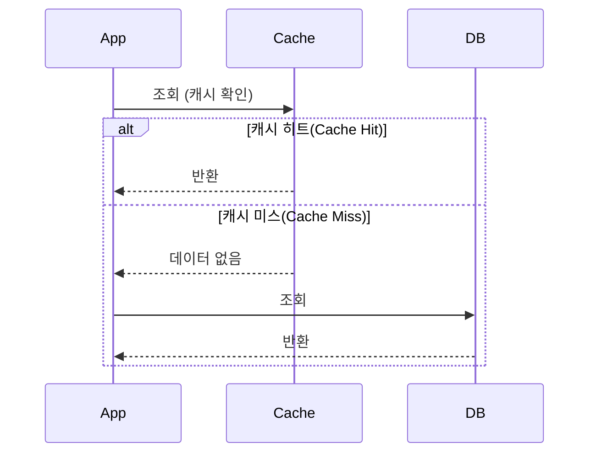
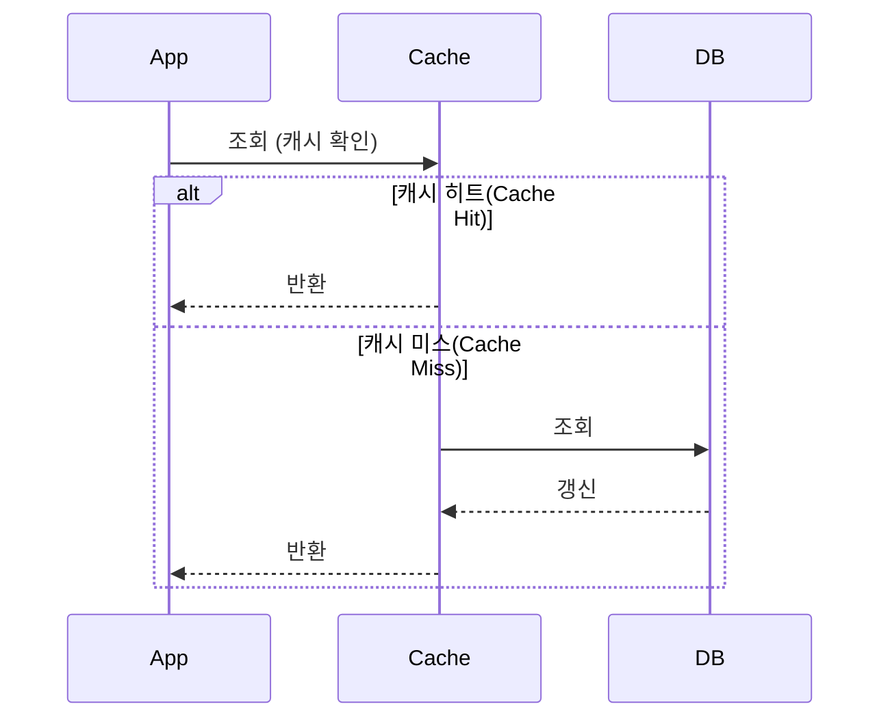
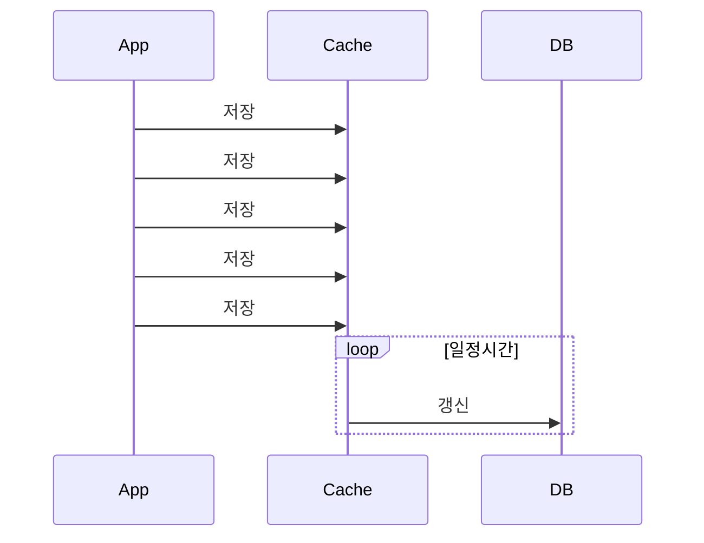
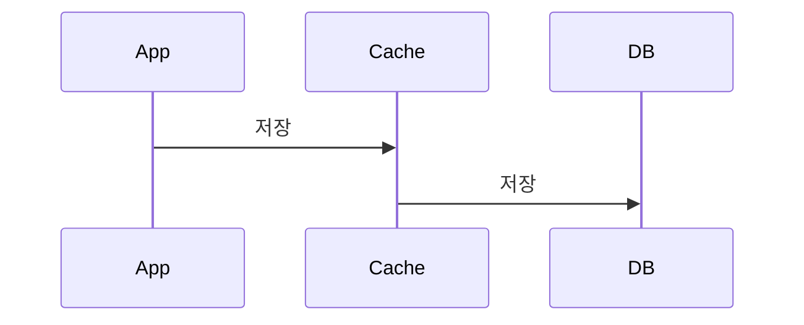
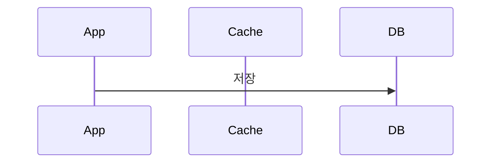

# 캐싱

## 캐시란

- API 의 응답속도를 빠르게 하기 위해서 상대적으로 빠른 데이터 저장소에 미리 준비해두는 행위, 계층, 데이터

## 캐시 종류

- 로컬 캐시
  - 보통 애플리케이션 안에서 메모리에 데이터 적재
  - 단일 애플리케이션이라면 로컬 캐시로 충분할 수 있다
- 원격 캐시
  - 기본적으로 분산 환경에서 고려
  - 분산 환경에서 여러 애플리케이션이 참조하는 캐시서버
  - redis, cdn 이 대표적

## 캐싱전략

- 읽기전략
  - Look Aside
    - 캐시를 먼저 조회해보고 없으면 database 를 조회하는 패턴
    - 가장 일반적으로 사용되는 패턴
    - 캐시에 장애가 발생해도 데이터 가져올 수 있음

  - Read Through
    - 캐시를 먼저 조회해보고 없으면 database 에서 업데이트를 하는 패턴
    - 업데이트의 주체는 서버가 아닌 database
    - 캐시에 장애가 발생하면 서비스 장애로 이어짐

- 쓰기전략
  - Write Back
    - 데이터를 저장할때 바로 DB에 하지않고 캐시에 모았다가 일정 주기로 반영
    - 좋아요 기능 정도에서 사용가능하지 않을까?? 싶다

  - Write Through
    - 데이터를 저장할때 바로 캐시와 DB를 모두 저장하는 방식
    - 업데이트가 2번씩 들어가기에 성능이 좋지 않을 수 있음
    - 캐시와 DB를 모두 업데이트하기 때문에 정합성이 우수

  - Write Around
    - 항상 DB에 업데이트
    - 캐시에 데이터가 업데이트가 안되면 둘다 업데이트

## 캐싱이 필요한 로직 및 이유

콘서트 조회 로직이 가장 적합하지 않을까 싶다.

현재 콘서트 대기열 시스템에 조회기능은 날짜에 맞는 콘서트 목록 조회와

콘서트에 좌석 조회 2가지 조회로직이 있다.

그중 좌석은 예약이나 만료등으로 변경이 잦아 데이터 정합성이 깨지는 순간이 많을 것 같다

콘서트는 변경이 적은 데이터라고 생각되어 콘서트 조회를 캐싱할 예정이다.
