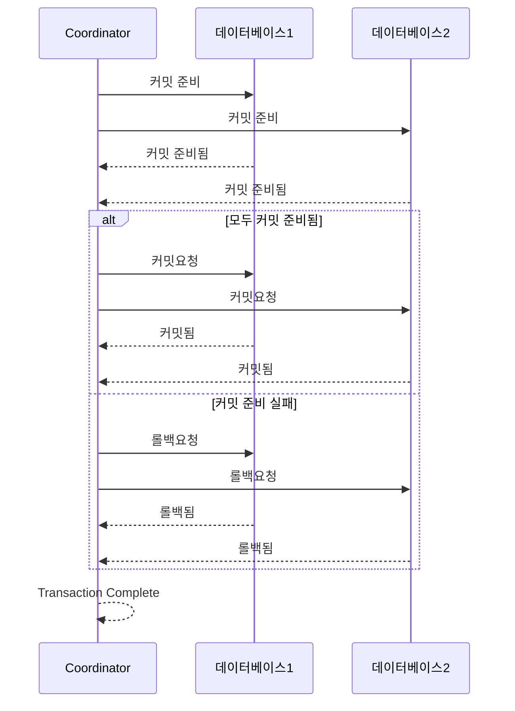

## 1. 분산 트랜잭션이란?

```
분산 트랜잭션은 단일 데이터베이스가 아닌 여러 데이터베이스 혹은
 
여러 데이터베이스와 여러 서비스간의 통신을 하나로 묶어주는 작업의 단위이며,

데이터베이스 트랜잭션처럼 ACID(원자성, 일관성, 동립성, 지속성)한 연산을 제공해야 한다.
```

## 2. 어떤 분산 트랜잭션들이 있는가?

```
1. 2PC (2 Phase Commit)

이름에서 알 수 있듯 2개의 단계를 거쳐 분산 트랜잭션을 처리하게 된다.
먼저 데이터를 읽고 쓴뒤 1단계가 시작된다. 

1단계는 각 노드별로 커밋가능여부를 물어본다.
2단계는 모든 노드들이 커밋이 가능하다는 응답을 받으면 그때 커밋을 진행한다.

모두 커밋이 가능한 상태까지 기다린 다음에 커밋을 진행하기 때문에 강력한 일관성을 제공한다. 
하지만 모두 커밋이 가능한 상태까지 기다린 다음에 커밋을 진행하기 때문에 성능이 좋지 못하다.

그리고 데이터베이스를 모두 알고 데이터베이스와 직접 상호작용하는 방법으로,
애플리케이션 단위로 나누는 MSA 구조에서는 적합하지 않다.
```

```
2. SAGA 패턴

여러 서비스의 연산을 순차적으로 배치하고 실행하는 방법으로

실패시의 실행할 보상 트랜잭션 개념의 역연산도 만들어 놔야 한다

순서대로 연산을 배치하고 한 연산이 완료되면 다음 연산을 실행한다.

연산이 실패하면 보상트랜잭션을 연산 실행 반대 순서로 실행한다.

서비스 단위로 실행하기에 MSA 구조에 적합하고, 확장성이 좋다

하지만 연산을 쌍으로 2개씩 만들어야 하기 때문에 비용이 많이 든다. 

SAGA 패턴에는 두 가지 구현 방법이 있다.
```

## 3. 어디에 분산 트랜잭션 적용이 가능한가?

```
나중에 서비스가 커지고 각각 도메인별로 서비스가 나뉘게 되면

기존에 트랜잭션이 필요했던 좌석 예약기능, 예약 결제 기능이 

단일 데이터베이스에서 여러 서비스로 나뉘면서 분산 트랜잭션이 필요해질 것으로 예상된다.
```
```kotlin
@Transactional
fun bookSeat(seatId: Long, uuid: UUID): BookingResult {
    val token = tokenService.getByUuid(uuid)
    val concert = concertService.get(token.concertId)

    bookingValidator.validate(token, concert)

    val user = userService.get(token.userId)
    val seat = seatService.get(seatId)

    return bookingService.create(user, seat)
        .let { BookingResult.from(it) }
}
```
```kotlin
@Transactional
fun create(dto: PaymentCreateDto): PaymentDto {
    val seat = requireNotNull(seatRepository.findById(dto.seatId)) { "좌석 정보가 없습니다." }
    val user = requireNotNull(userRepository.findById(dto.userId)) { "유저 정보가 없습니다." }
    val booking = requireNotNull(bookingRepository.findByIdWithLock(dto.bookingId)) { "예약 정보가 없습니다." }
    val point = requireNotNull(pointRepository.findByUserIdWithLock(user.id)) { "포인트 정보가 없습니다." }

    val history = point.use(seat.price)
    pointHistoryRepository.save(history)

    booking.confirmedAt(dto.paidAt)

    val payment = Payment(booking.id, seat.price)
    val saved = paymentRepository.save(payment)

    return PaymentDto(saved.id, saved.amount)
}
```


## 4. 적용한다면