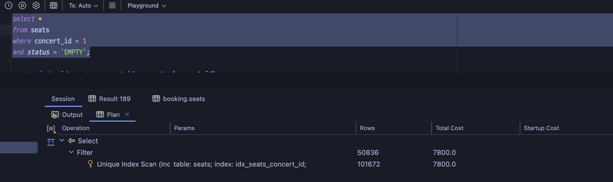

## 1. 인덱스란 무엇인가?
```
인덱스는 책으로 비유하면 목차(색인)라고 할 수 있다.

책에서 책 페이지수를 pk(id)라고 한다면 목차를 보고

빠르게 원하는 pk(id)를 찾아 갈 수 있다. 
```
## 2. 인덱스는 왜 필요한가?
```
위에서 말한 것중에 핵심이 있다

'빠르게'이다. 빠르게 원하는 데이터를 찾기 위해서 사용된다.

빠르게 데이터를 찾는다는 것은 조회의 속도를 높인다는 뜻이다.

그러면 왜 빠르게 조회해야 하는가

같은 서비스를 제공하고, 비슷한 디자인 비슷한 가격이라면

당연히 빠른 속도를 선호할 것이다.
```
## 3. 어디에 인덱스를 적용해야 하는가?
```
인덱스를 추가하는 것은 조회 성능을 높이는 작업이다.

당연히 조회 기능이 중요한 테이블에 인덱스를 추가해야 한다.

먼저 우리 프로젝트에서의 조회 API별 인덱스에 대한 나의 생각은 아래와 같다.

1. 대기열 정보 조회 API

    영속성이 필요한 데이터가 아닌 대기가 있을때만 필요한 데이터라 계속 테이블에 쌓을 필요가 없고,
    redis를 통해서 처리하고 있어 크게 조회 성능이 떨어질 요소는 없다고 판단했다. 

2. 날짜에 맞는 콘서트 조회 API

    API에서 조회 조건으로 시간데이터 타입을 사용하고 있는데, 
    시간데이터 타입은 인덱스를 거는 것이 거의 무의미할 수 있다.
    왜냐하면, 보통 시간데이터 타입은 범위로 검색을 할 때가 많은데
    시간데이터 타입은 데이터 형태에 따라 초, 밀리초 단위까지 인덱스를 생성할 가능성이 있다.
    그렇게 되면 풀스캔과 거의 차이점이 없을 수 있다.
    그러나, 콘서트의 경우 시간이 날짜 단위이기 때문에 인덱스 생성이 괜찮을 수도 있다.
      
3. 예약 가능한 좌석 조회 API

    예약 가능한 좌석 조회는 concertId, status 데이터를 사용한다.
    좌석 데이터는 콘서트와 1:N 으로 데이터 량이 많아 조회 성능이 저하될 수 있어 보인다.
    또 시간데이터 타입이 아닌 concertId, status 로 조회 조건을 사용하기 때문에
    인덱스 생성에도 적합해 보인다.  

4. 포인트 잔액 조회 API

    보통 로그인한 유저가 포인트 잔액을 조회하기 때문에 pk를 통한 조회가 가능하다.
    조회 성능이 떨어질 요소는 없다고 판단했다.
```
## 4. 어떻게 다른가?
```
콘서트 no 인덱스
```

```
콘서트 date 인덱스
```

```
좌석 no 인덱스
```

```
좌석 concertId 인덱스
```

```
좌석 status 인덱스
```

```
좌석 concertId, status 인덱스
```

```
좌석 status, concertId 인덱스
```


## 5. 결론

```
1. 시간 데이터 타입도 날짜만 저장하는 데이터일 경우 상당히 유의미한 성능 향상이 있었다.

2. status 같은 데이터로 인덱싱을 하면 성능향상 효과는 있으나 드라마틱 하지 않다.

3. 인덱스 생성시 컬럼 순서를 바꿔도 다르지 않다.
```
